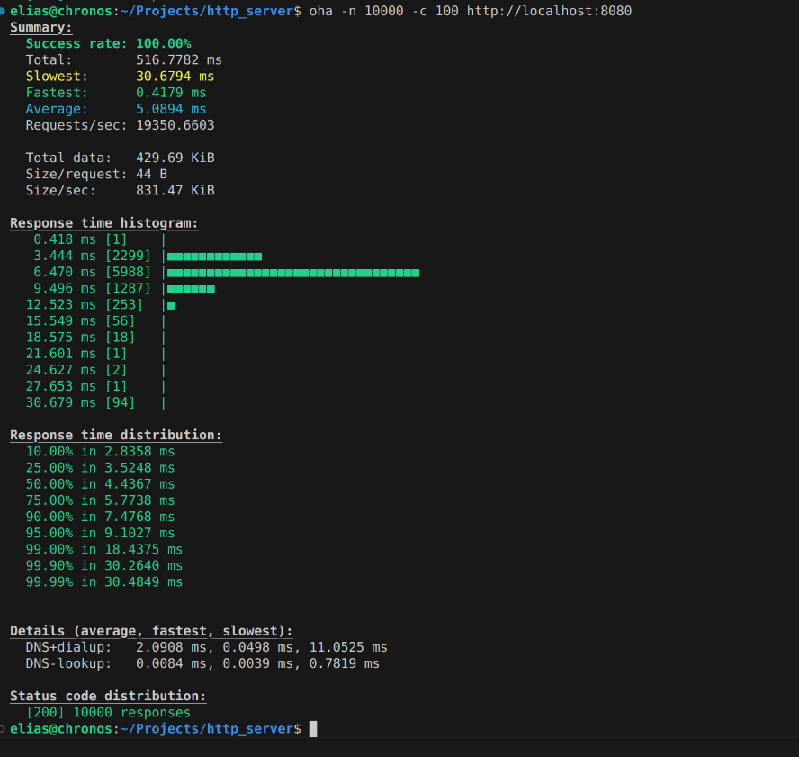

# Custom HTTP Server in Go

This project is a lightweight **custom HTTP server** built from scratch in **Go (Golang)**. It features low-level TCP networking, HTTP parsing, request routing, gzip compression, persistent connections, and support for file upload/download.

> No external frameworks or libraries for HTTP handling were used.  
> Built using `net`, `os`, and core Go packages only.


---

## 📚 Table of Contents

- [Core Features](#core-features)
- [Project Structure](#project-structure)
- [Installation](#installation)
- [Usage](#usage)
- [API Endpoints](#api-endpoints)
- [Performance](#performance)
- [Learnings](#learnings)
- [Future Improvements and To-Do](#future-improvements-and-to-do)

---

## Core Features

- **Custom HTTP Parsing**  
  Parses HTTP request line, headers, and body manually with no dependency on `net/http`.

- **Route Handling**  
  Follows an interface-driven approach using polymorphism. Each route implements the `Handler` interface, promoting separation of concerns.

- **Router**  
  Maps URL paths to specific handlers, including support for dynamic segments (e.g. `/echo/:value`).

- **Static File Serving**  
  Handles `GET` and `POST` for static files via a user-defined directory. Supports creation and retrieval.

- **Gzip Compression Support**  
  If `Accept-Encoding: gzip` is present, the response is compressed before being sent.

- **Custom 404 Error Pages**  
  Returns an informative user-facing HTML page when an unknown route is accessed.

- **Concurrent Persistent Connections**  
  Supports `Connection: keep-alive`, allowing multiple requests over a single TCP connection.

- **SOLID Design – Open/Closed Principle**  
  New features or routes can be added without modifying the core logic, enabling safe extensibility.

- **Extensible API Design**  
  Easily plug in new routes, file types, or compression strategies with minimal boilerplate.

---

## Project Structure

```t
├── src/                      # Core Go source files
│   ├── main.go               # Server entry point
│   ├── router.go             # URL routing and route resolution
│   ├── route_handler.go      # Implementations of route handlers
│   ├── request_handler.go    # Request parsing logic
│   ├── response.go           # Response construction and sending
│   └── gzip_compressor.go    # Utilities for Gzip compression
│
├── files/                    # Sample files for GET/POST testing
│   ├── readme.txt
│   └── readmetoo.json
│
├── web/                      # Static web pages for fallback/error display
│   ├── index.html
│   └── Pagenotfound.html
│
├── .gitignore                # Git ignore rules
└── README.md                 # Project documentation
```

---

## Installation

### Prerequisites

- [Go (Golang)](https://golang.org/dl/) installed (version 1.18 or later)
- A terminal or shell (e.g., Bash, Zsh, Command Prompt)
- (Optional) `curl` or `oha` for sending HTTP requests and load testing

Follow the steps below to build and run the custom HTTP server on your local machine:

### 1. Clone the Repository

`git clone https://github.com/your-username/custom-http-server.git`
`cd custom-http-server`

### 2. Build Project

`make build`

### 3. Run project

refence [Usage](#usage) to run and use the server.

---

##  Usage

### Running the Server

After building the project, you can start the server using:

`./bin/src` 
or `make run`

---

## API Endpoints

### Testing Endpoints and  Server Features 

You can test the HTTP server using tools like curl, Postman, or any REST client of your choice.

to use curl open a new terminal.

To test various end-points and methods:

- **Echo endpoint:**  
    To create a new file on the server:
        Send a message to be echoed back by the server:
            `curl http://localhost:8080/echo/hello, anyone home!!!`

- **Root endpoint:**
    Acess the root of the server:
        `curl http://localhost:8080/`

    Expected ouput:

        This is root.

- **GET Request:** 
  Get resource from server.
  - **files endpoint:** 
    To test file endpoint run the server:
        start server witha specified directory:
            `./bin/src --directory ./files` 

    To get file from the server:
        in another terminal: 
            `curl http://localhost:8080/files/readme.txt`

- **POST Request:**  
    To create a new file on the server:
        `curl -X POST http://localhost:8080/files/newfile.txt -d "New content on the server."`

- **gzip Compression:**
    If the client supports gzip, you can request compressed responses by using the `--compressed` flag in `curl`:
        `curl -v -H "Accept-Encoding: gzip" http://localhost:8080/echo/abc` encoded output will be viewed as hexadecimal.
        `curl -v -H "Accept-Encoding: gzip" http://localhost:8080/echo/abc | hexdump -C` to view encoded output as bytes

    Expected output:
        The server will respond with gzip compressed response body and appropraite response header contaning `Content-Encoding: gzip`
        
- **Concurrent Persistent Connections:**
    The server supports HTTP/1.1 keep-alive connections by default. This allows the client to send multiple HTTP requests over the same TCP connection without reopening it:
        `curl --http1.1 -v http://localhost:8080/user-agent -H "User-Agent: orange/mango-grape" --next http://localhost:8080/echo/apple`

    How it works:

        - The server checks for the "Connection: keep-alive header.

        - If found, it keeps the connection open to process additional requests from the same client.

        - If not specified (or close is specified), the connection is closed after the first response.

---

## Performance

The server performance test was done with **oha** It is a tool for stressing web server by generating HTTP Request load. Follow their [installation guide](https://github.com/hatoo/oha) to install it. Once you are done installing you can run in a new terminal:

- `oha --help`

You would get some details on how to use it.

To run performance test simulating 1000 request and 50 concurrent connection, provided your server is running run:

- `oha -n 1000 -c 50 http://localhost:8080`



## Learnings

Some important concepts I reinforcend and learnt while building this project include:
- **HTTP Protocol Internals:**  
  Gained a low-level understanding of how HTTP works — including request structure, status codes, headers, persistent connections, and content negotiation.

- **TCP Socket Programming:**  
  Built a server using raw `net.Conn` TCP streams, understanding how data transmission, blocking I/O, and connection handling works under the hood.

- **Interface-Oriented Programming:**  
  Using Go interfaces (`Handler`) allowed decoupling of routing logic and handler implementations, showcasing the power of abstraction and polymorphism.

- **Open/Closed Principle (SOLID):**  
  The server is designed to be **open to extension but closed to modification**. New routes or behaviors can be added without changing existing logic, supporting scalability and future growth.

- **Concurrency and Goroutines:**  
  Used goroutines to handle concurrent connections, applying producer-consumer patterns and learning about channel-based coordination in Go.


- **Code Extensibility & Maintainability:**  
  The project reinforces how to write extensible code that can adapt to new features (e.g., gzip, persistent connections) with minimal changes.


## Future Improvements and To-Do 

- [ ] Figure why server success rate from stress testing drops from 100% to 85% after adding gzip compression and fix it.
- [ ] Add Support for PUT and DELETE methods
- [ ] Add TLS/SSL support to enable secure communication over HTTPS.
- [ ] Add loggin Mechanisms
- [ ] Add Unit test


    


